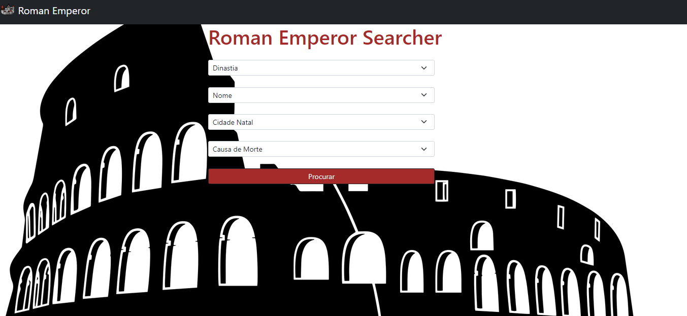
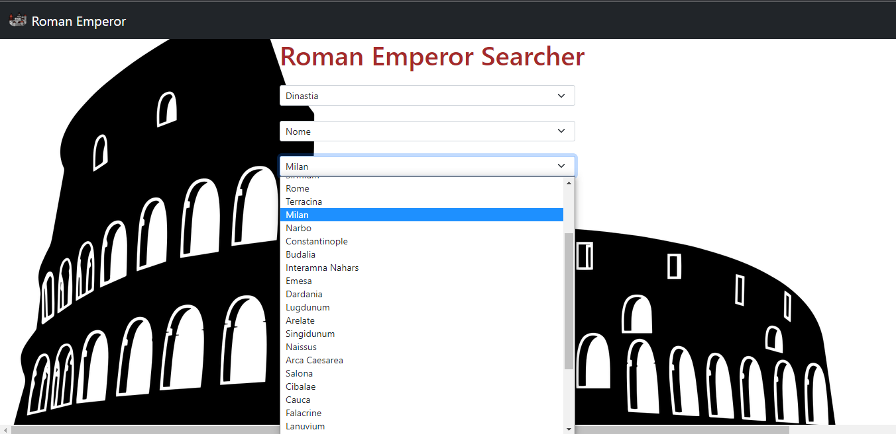

# Roman Emperors Searcher

**Número da Lista**: 8<br>
**Conteúdo da Disciplina**: Grafos 1<br>

## Alunos
|Matrícula | Aluno |
| -- | -- |
| 19/0026375  |  Daniel Vinicius Ribeiro Alves |
| 19/0025298  |  Bianca Sofia Brasil de Oliveira |

## Sobre 
Roman Emperor é um contador de histórias para os apaixonados pela história romana, baseado em pesquisas em grafos, em que o usuário escolhe um item para filtrar e o Roman mostra as linhagens encontradas na base de dados referentes a pesquisa, tendo como objetivo facilitar os estudos à respeito da roma antiga. 

## Screenshots

<center>


<figcaption>Página inicial</figcaption>

</center>


<center>


<figcaption>Pesquisa dados</figcaption>

</center>

<center>


<figcaption>História encontrada</figcaption>

</center>


## Instalação

**Linguagem**: JavaScript<br>

Para rodar o projeto localmente, é necessário possuir o node instalado na máquina

Clone o repositório em sua máquina local e baixe as dependências com npm install.

Para executar o projeto:

```
node main.js
```

O projeto estará em execução no endereço `localhost:3001`


